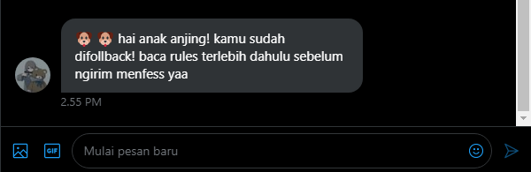
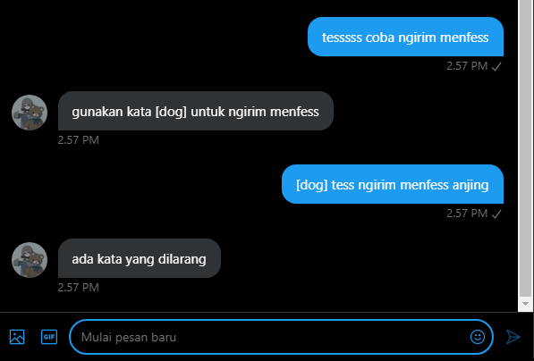
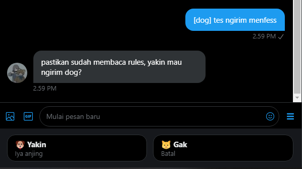
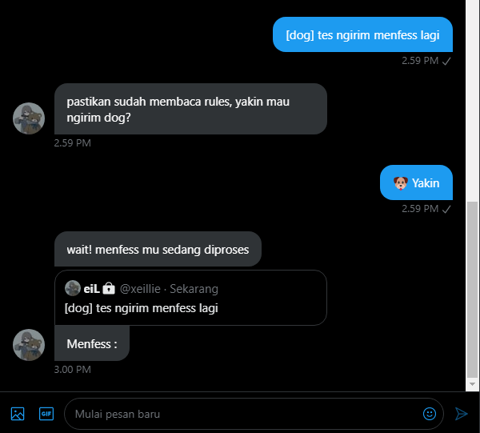
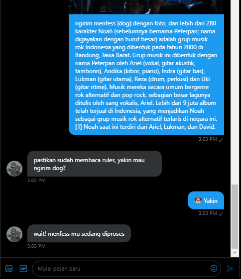
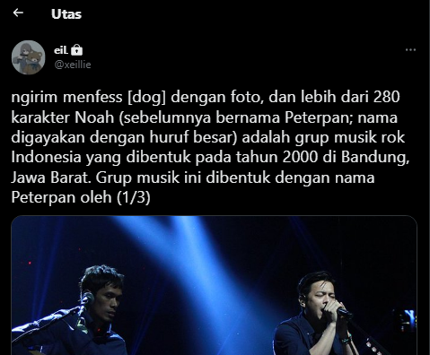
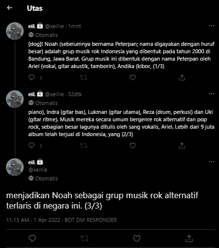
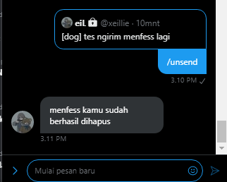
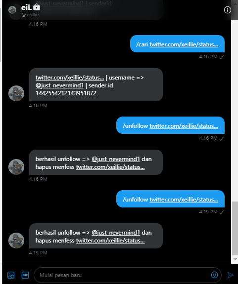
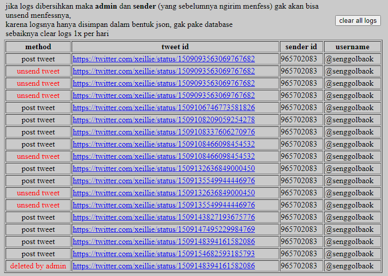

## NO LONGER AVAILABLE
Sorry, this script no longer available | reason : https://twitter.com/TwitterDev/status/1649191520250245121 
Still work if using Enterprise APIs | reason : https://twitter.com/TwitterDev/status/1649191522485817345 

## Bot Autobase Twitter (PHP)

Bot Menfess / Autobase Twitter, using webhooks to receive and deliver real time updates. 
Bot untuk menerima DM lalu mempublikasikannya sebagai Tweet, atau yang biasa disebut *menfess*. 
*Seperti akun @bdngfess, @bandungfess, @sunda_fess, @codingfess dll*.  
:arrow_right:[Example](#example--instruction)
___
:warning: ***dilarang keras digunakan untuk membuat base yang mengandung konten dewasa / alter.***
___
- Coded with :smoking: by @senggolbaok

## Required (*)
- [x] Akun Developer Twitter sudah di-Approve *Elevated Access*nya
- [x] Set Up *Account Activity API* di [Dev Environments](https://developer.twitter.com/en/account/environments)
- [x] App permissions pilih yang *Read and write and Direct message*

## Installation
1. Isi `CONSUMER KEY, dll` di file `config.php`
2. Jalankan `setWebhook.php`
3. Done~

## Features
- [x] Mengirim Pesan otomatis ketika follback seseorang
- [x] Filter text dari kata tidak pantas
- [x] Filter akun sender tidak bisa mengirim *menfess* jika :
  - [x] followers kurang dari 10
  - [ ] akun belum lebih dari 1 bulan *(will be updated soon)* :x:
  - [ ] tweet kurang dari 500 *(will be updated soon)* :x:
- [x] Menfess status dengan gambar
- [x] Menfess lebih dari 280 karakter
- [x] Mengirim [quick reply](https://developer.twitter.com/en/docs/twitter-api/v1/direct-messages/quick-replies/api-reference/options) button
- [x] Tambahkan kata `OFF` di **Bio** untuk menonaktifkan Base. (Jika tidak ada kata `OFF` di Bio, maka Bot akan berfungsi)
- [x] Unsend menfess
  - Command `/unsend` untuk menghapus menfess yang terakhir dikirimnya.
  - Atau command `/unsend url` *(menambahkan url manual)* 
- [x] Command khusus admin : 
   - `/delete url` untuk menghapus menfess.
   - `/cari url` untuk mengetahui siapa *Sender* dari menfess *yang dimaksud*
   - `/unfollow url` untuk menghapus menfess sekaligus mengunfollow sendernya

## Bugs
- [ ] Not support video/gif. *(will be updated soon)*. :x:

## License
This open-source software is distributed under the MIT License. See [License](LICENSE)

## Contributing
All kinds of contributions are welcome.
- Bug reports.
- Fix bugs / add new features.

## Example & Instruction

#### - Send Automated Messages when Follback someone

#### - Filter message

#### - Quick reply button

#### - Send Message when success posted as Tweet

#### - More than 280 Character (w/ Image)

  
#### - More than 280 Character (no Image)

#### - Unsend menfess

#### Command *Admin Only*

___
#### Instruction - /logs
Setiap ada yang mengirim atau unsend menfess, logs-nya akan disimpan dalam bentuk json. Jika logs dihapus maka (admin dan sender) tidak akan bisa menghapus menfess (menggunakan *Command*).   
File `shadowLog.php` dibuat untuk melihat, dan membersihkan logs.   

## Reference & Library

> Ref : https://developer.twitter.com/en/docs/twitter-api/enterprise/account-activity-api/guides/getting-started-with-webhooks

> Lib : [php-twitter-webhook-account-activity-api](https://github.com/sadaimudiNaadhar/php-twitter-webhook-account-activity-api)

> Lib : [twitteroauth](https://github.com/abraham/twitteroauth)
